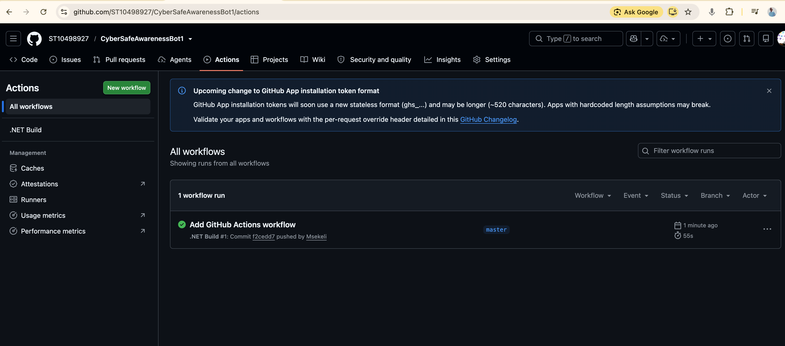

# CyberSafe Awareness Bot

## Student
Name: Msekeli Mkwibiso
Student Number: ST10498927

## Project Description
CyberSafe Awareness Bot is a C# console application that provides basic cybersecurity awareness information through an interactive chatbot.

## Features
- Voice greeting using a WAV audio file
- Cybersecurity ASCII art header
- Personalised greeting using the user's name
- Password safety information
- Phishing information
- Safe browsing information
- General cybersecurity questions
- Input validation
- Exit command
- Coloured and formatted console interface

## Technologies
- C#
- .NET 9
- Visual Studio
- GitHub
- GitHub Actions

## How to Run
1. Clone the repository.
2. Open the solution in Visual Studio.
3. Build the solution.
4. Run the application.
5. Enter your name and ask a cybersecurity question.
6. Type `exit` to close the application.

## Requirements
- Visual Studio 2022
- .NET 9 SDK

## GitHub Actions
The project uses GitHub Actions to restore and build the .NET application automatically.

## Video Presentation
[Watch the CyberSafe Awareness Bot presentation](https://youtu.be/RljzJ_WdZNQ)